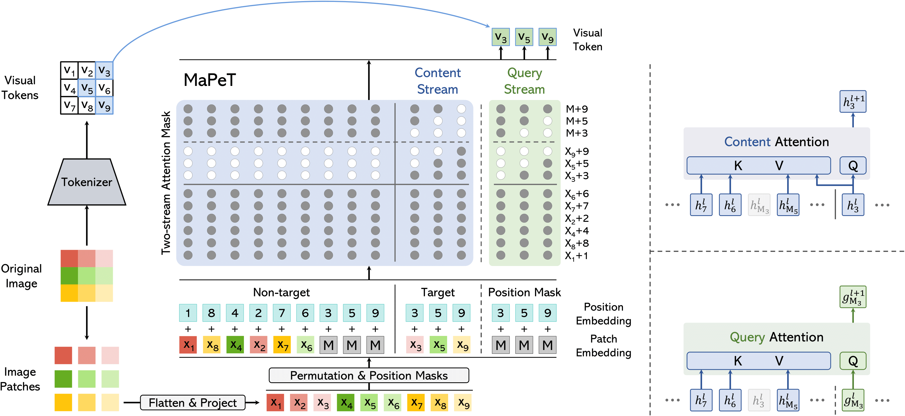

<div align="center">
  <h1>MaPeT: Learning to Mask and Permute Visual Tokens for Vision Transformer Pre-Training </h1>

  [](https://arxiv.org/abs/2306.07346)

</div>

[**Lorenzo Baraldi**](https://aimagelab.ing.unimore.it/imagelab/person.asp?idpersona=163)**&ast;**,
[**Roberto Amoroso**](https://scholar.google.com/citations?user=ZwnSLF8AAAAJ)**&ast;**,
[**Marcella Cornia**](https://scholar.google.com/citations?user=DzgmSJEAAAAJ),
[**Lorenzo Baraldi**](https://scholar.google.com/citations?user=V4RuMvsAAAAJ),
[**Andrea Pilzer**](https://scholar.google.com/citations?user=zooORRsAAAAJ),
[**Rita Cucchiara**](https://scholar.google.com/citations?user=OM3sZEoAAAAJ)

**&ast;** Equal contribution.

This is the **official repository** for the paper [Learning to Mask and Permute Visual Tokens for Vision Transformer Pre-Training](https://arxiv.org/abs/2306.07346) (Computer Vision and Image Understanding, 2025).

## Overview

<p align="center">
    
</p>

>**Abstract**: <br>
> The use of self-supervised pre-training has emerged as a promising approach to enhance the performance of visual tasks such as image classification. In this context, recent approaches have employed the Masked Image Modeling paradigm, which pre-trains a backbone by reconstructing visual tokens associated with randomly masked image patches. This masking approach, however, introduces noise into the input data during pre-training, leading to discrepancies that can impair performance during the fine-tuning phase. Furthermore, input masking neglects the dependencies between corrupted patches, increasing the inconsistencies observed in downstream fine-tuning tasks. To overcome these issues, we propose a new self-supervised pre-training approach, named Masked and Permuted Vision Transformer (**MaPeT**), that employs autoregressive and permuted predictions to capture intra-patch dependencies. In addition, **MaPeT** employs auxiliary positional information to reduce the disparity between the pre-training and fine-tuning phases. In our experiments, we employ a fair setting to ensure reliable and meaningful comparisons and conduct investigations on multiple visual tokenizers, including our proposed _k_-CLIP which directly employs discretized CLIP features. Our results demonstrate that **MaPeT** achieves competitive performance on ImageNet, compared to baselines and competitors under the same model setting.

## Citation
If you make use of our work, please cite our paper:

```bibtex
@article{baraldi2025learning,
      title={{Learning to Mask and Permute Visual Tokens for Vision Transformer Pre-Training}}, 
      author={Lorenzo Baraldi and Roberto Amoroso and Marcella Cornia and Lorenzo Baraldi and Andrea Pilzer and Rita Cucchiara},
      journal={Computer Vision and Image Understanding},
      year={2025},
}
```

## Getting Started

Follow these steps to get started with the project:

1. Create a new conda environment: `conda create -n mapet python=3.8.16`
2. Activate the environment: `conda activate mapet`
3. Clone the repository: `git clone https://github.com/aimagelab/MaPeT.git`
4. Change directory to the project root: `cd MaPeT`
5. Install the required dependencies: `pip install -r requirements.txt`

To run validation with the default parameters, run the following command:

```python -u validate.py <PathToImageNet> --model <model_name> --checkpoint <checkpoint_path> --interpolation "bicubic" --amp --gp "avg" --pin-mem --no-prefetcher ```

where:
- ```<PathToImageNet>``` is the path to the ImageNet dataset (_e.g._, `data/ImageNet/ILSVRC/Data/CLS-LOC`).
- ```<model_name>``` is the name of the model to be used. Available models are:
    - ```vit_standard_tiny_patch16_224```: checkpoints for [k-CLIP](https://ailb-web.ing.unimore.it/publicfiles/MaPeT_checkpoints/vit_standard_tiny_patch16_224_KCLIP.tar) and [VQ-KD](https://ailb-web.ing.unimore.it/publicfiles/MaPeT_checkpoints/vit_standard_tiny_patch16_224_VQKD.tar).
    - ```vit_standard_small_patch16_224```: checkpoints for [k-CLIP](https://ailb-web.ing.unimore.it/publicfiles/MaPeT_checkpoints/vit_standard_small_patch16_224_KCLIP.tar) and [VQ-KD](https://ailb-web.ing.unimore.it/publicfiles/MaPeT_checkpoints/vit_standard_small_patch16_224_VQKD.tar).
    - ```vit_standard_base_patch16_224```: checkpoints for [k-CLIP](https://ailb-web.ing.unimore.it/publicfiles/MaPeT_checkpoints/vit_standard_base_patch16_224_KCLIP.tar) and [VQ-KD](https://ailb-web.ing.unimore.it/publicfiles/MaPeT_checkpoints/vit_standard_base_patch16_224_VQKD.tar).
- ```<checkpoint_path>``` is the path to the checkpoint to be used.

## External Code employed

This project makes use of code on the following external code repositories:

- [TIMM](https://github.com/huggingface/pytorch-image-models): A collection of PyTorch models for computer vision tasks.
- [BEiT](https://github.com/microsoft/unilm/tree/master/beit2): BEiT implementation in Pytorch.
- [CAE](https://github.com/lxtGH/CAE): Code repository for the Contrastive Adversarial Exemplar (CAE) model.
- [CLIP](https://github.com/openai/CLIP): OpenAI's CLIP (Contrastive Language-Image Pretraining) model.
- [Faiss](https://github.com/facebookresearch/faiss): Faiss is a library for efficient similarity search and clustering of dense vectors.


## Acknowledgements
We acknowledge the CINECA award under the ISCRA initiative, for the availability of high-performance computing resources. This work has partially been supported by the PNRR-M4C2 (PE00000013) project “FAIR - Future Artificial Intelligence Research” and the Horizon Europe project “ELSA - European Lighthouse on Secure and Safe AI” (GA 101070617), both funded by the European Union.
